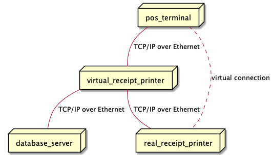

# README

This project contains an ESC/POS binary decoder written in Python.

ESC/POS describes the standard printing command syntax and protocol used between POS (point of sale) terminals and EPSON's thermal printers.

# ESC/POS decoder

The ESC/POS decoder is realized in `esc_pos_decoder.py`.
The decoder itself is implemented as a state machine.
It has various verbosity levels.
For further usage details and documentation, please check the source code.

# Demo application

This repository also contains a demo application (`app.py`) which uses the EscPosDecoder ESC/POS binary decoder class in its processing loop. The application opens a TCP/IP port to listen for incoming data. The incoming data is fed to the decoder.
After no more data has been received, the data is decoded as whole block. The whole data is re-transmit to the real printer via TCP/IP. Furthermore, the decoded text is encoded as JSON message. In a future version it could be forwarded to a web server for further processing. This is really just a little demo code to show how the decoder could be used in a more or less production-like environment.

## System architecture

# Tests

There are tests which check the Python code style of the decoder and demo application code.
However, they require additional resources (binary files) gathered from the internet. They are not publicly shared.

The decoder itself should work without any dependencies. However, for testing install the `pycodestyle` module.

Or simply run the following: `python3 install -r requirements.txt`

Note: E501 (line too long) and E722 (bare excepts) are ignored on purpose.
